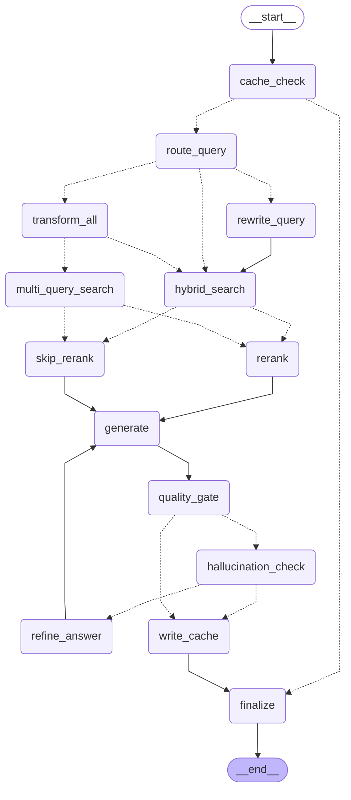

```mermaid
---
config:
  flowchart:
    curve: linear
---
graph TD;
	__start__([<p>__start__</p>]):::first
	cache_check(cache_check)
	route_query(route_query)
	rewrite_query(rewrite_query)
	transform_all(transform_all)
	hybrid_search(hybrid_search)
	multi_query_search(multi_query_search)
	rerank(rerank)
	skip_rerank(skip_rerank)
	generate(generate)
	quality_gate(quality_gate)
	hallucination_check(hallucination_check)
	refine_answer(refine_answer)
	write_cache(write_cache)
	finalize(finalize)
	__end__([<p>__end__</p>]):::last
	__start__ --> cache_check;
	cache_check -.-> finalize;
	cache_check -.-> route_query;
	generate --> quality_gate;
	hallucination_check -.-> refine_answer;
	hallucination_check -.-> write_cache;
	hybrid_search -.-> rerank;
	hybrid_search -.-> skip_rerank;
	multi_query_search -.-> rerank;
	multi_query_search -.-> skip_rerank;
	quality_gate -.-> hallucination_check;
	quality_gate -.-> write_cache;
	refine_answer --> generate;
	rerank --> generate;
	rewrite_query --> hybrid_search;
	route_query -.-> hybrid_search;
	route_query -.-> rewrite_query;
	route_query -.-> transform_all;
	skip_rerank --> generate;
	transform_all -.-> hybrid_search;
	transform_all -.-> multi_query_search;
	write_cache --> finalize;
	finalize --> __end__;
	classDef default fill:#f2f0ff,line-height:1.2
	classDef first fill-opacity:0
	classDef last fill:#bfb6fc

```